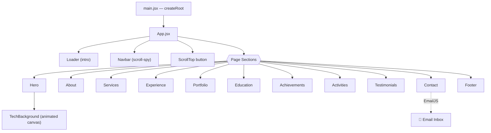
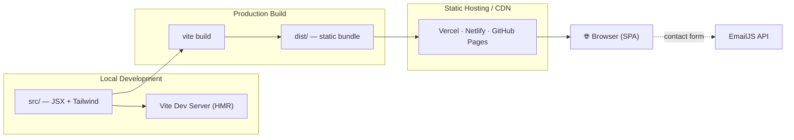
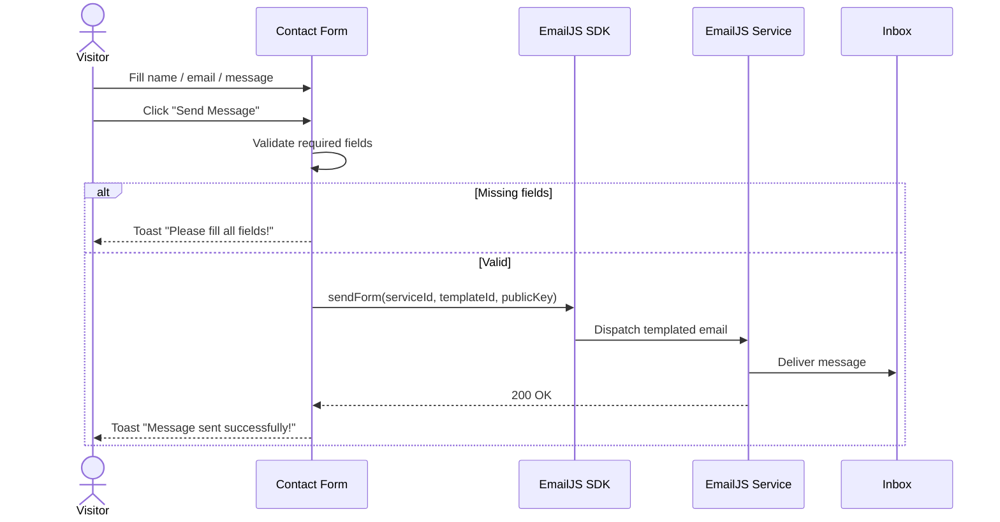

<div align="center">

# Aakash Wijesekara — Portfolio

### A fast, animated, single-page personal portfolio

Computer Science Undergraduate · Software Engineer Intern @ WSO2

<br/>


<br/>


</div>

---

## 📑 Table of Contents

- [Overview](#-overview)
- [Features](#-features)
- [Tech Stack](#-tech-stack)
- [Architecture](#-architecture)
  - [Component Tree](#component-tree)
  - [Build & Runtime Flow](#build--runtime-flow)
  - [Contact Form Flow](#contact-form-flow)
- [Project Structure](#-project-structure)
- [Getting Started](#-getting-started)
- [Configuration](#-configuration)
- [Available Scripts](#-available-scripts)
- [Deployment](#-deployment)
- [License](#-license)

---

## 🧭 Overview

A modern, responsive single-page application (SPA) that showcases my background, skills,
professional experience, projects, education, achievements, and testimonials — with a
working contact form powered by [EmailJS](https://www.emailjs.com/).

The site is built as a **static SPA**: there is no backend server. All content is bundled
at build time and served as static assets, while the contact form talks directly to the
EmailJS API from the browser.

<div align="center">


</div>

---

## ✨ Features

| | Feature | Description |
|---|---|---|
| 🎬 | **Animated UI** | Section reveal, staggered skill bars, and page transitions via Framer Motion. |
| 📱 | **Fully responsive** | Mobile-first layouts with an accessible slide-down mobile menu. |
| 🧭 | **Smart navigation** | Scroll-spy active section highlighting + hide-on-scroll navbar. |
| ⚡ | **Real load gating** | Loader is tied to the actual page `load` event (with a safety cap), not a fake timer. |
| 🖼️ | **Performance-aware** | Lazy-loaded below-the-fold images and a prioritized hero image. |
| ♿ | **Accessibility** | `prefers-reduced-motion` support, ARIA labels, keyboard-friendly menu (Esc to close). |
| 📨 | **Working contact form** | Client-side validation + EmailJS delivery with toast feedback. |
| 🔍 | **SEO ready** | Open Graph / Twitter cards, descriptive meta tags, and theme color. |

---

## 🧱 Tech Stack

| Layer | Technologies |
|---|---|
| **Framework** | React 19 |
| **Build Tool** | Vite 7 |
| **Styling** | Tailwind CSS 4 (`@import "tailwindcss"`), PostCSS, Autoprefixer |
| **Animation** | Framer Motion |
| **Icons** | react-icons (Font Awesome + Simple Icons) |
| **Notifications** | react-hot-toast |
| **Email** | emailjs-com |
| **Tooling** | ESLint 9, Vite Preview |

---

## 🏗️ Architecture

### Component Tree



### Build & Runtime Flow



### Contact Form Flow



---

## 📂 Project Structure

```text
AAKASH_WIJESEKARA_PORTFOLIO/
├── public/                 # Static assets served as-is (favicon, svg)
├── src/
│   ├── assets/             # Images, icons, resume (PDF)
│   ├── components/
│   │   ├── Navbar.jsx          # Sticky nav, scroll-spy, mobile menu
│   │   ├── Hero.jsx            # Landing section + animated background
│   │   ├── TechBackground.jsx  # Canvas particle/network background
│   │   ├── About.jsx           # Bio + animated technical skill bars
│   │   ├── Services.jsx        # Areas of learning & practice
│   │   ├── Experience.jsx      # Professional experience (WSO2)
│   │   ├── Portfolio.jsx       # Projects grid + detail modal
│   │   ├── Education.jsx       # Academic timeline
│   │   ├── Achievements.jsx    # Certificates / achievements
│   │   ├── Activities.jsx      # Extracurricular activities
│   │   ├── Testimonials.jsx    # References
│   │   ├── Contact.jsx         # EmailJS contact form
│   │   ├── Footer.jsx          # Footer nav + social links
│   │   ├── Loader.jsx          # Intro loader
│   │   └── ScrollTop.jsx       # Back-to-top control
│   ├── App.jsx             # Composition + loader gating
│   ├── main.jsx            # React entry point
│   └── index.css           # Tailwind import + base/global styles
├── index.html              # HTML shell + SEO / social meta
├── vite.config.js
├── tailwind.config.cjs
├── postcss.config.cjs
├── eslint.config.js
├── .env.example            # Template for EmailJS credentials
└── package.json
```

---

## 🚀 Getting Started

### Prerequisites

- **Node.js ≥ 20.19** (required by Vite 7)
- **npm** (bundled with Node)

### Installation

```bash
# 1. Install dependencies
npm install

# 2. Create your environment file
cp .env.example .env
#    then fill in your EmailJS values (see Configuration below)

# 3. Start the dev server
npm run dev
```

The app runs at **http://localhost:5173** by default.

---

## ⚙️ Configuration

The contact form uses [EmailJS](https://dashboard.emailjs.com/). Provide the following
environment variables in a `.env` file at the project root (Vite only exposes variables
prefixed with `VITE_`):

| Variable | Description |
|---|---|
| `VITE_EMAILJS_SERVICE_ID` | EmailJS service ID |
| `VITE_EMAILJS_TEMPLATE_ID` | EmailJS email template ID |
| `VITE_EMAILJS_PUBLIC_KEY` | EmailJS public key |

> `.env` is git-ignored; `.env.example` is tracked as a template.

---

## 📜 Available Scripts

| Command | Description |
|---|---|
| `npm run dev` | Start the Vite dev server with HMR |
| `npm run build` | Produce an optimized production build in `dist/` |
| `npm run preview` | Serve the production build locally |
| `npm run lint` | Run ESLint across the project |

---

## ☁️ Deployment

Any static host works since the output in `dist/` is fully static:

1. Build the site:
   ```bash
   npm run build
   ```
2. Deploy the `dist/` folder to a static host (e.g. **Vercel**, **Netlify**, or **GitHub Pages**).
3. Set the `VITE_EMAILJS_*` environment variables in your host's dashboard so the contact
   form works in production.

---

## 📄 License

**© Aakash Wijesekara. All rights reserved.**

This is a private project. The source code, design, content, and assets are not licensed
for reuse, redistribution, or modification.
