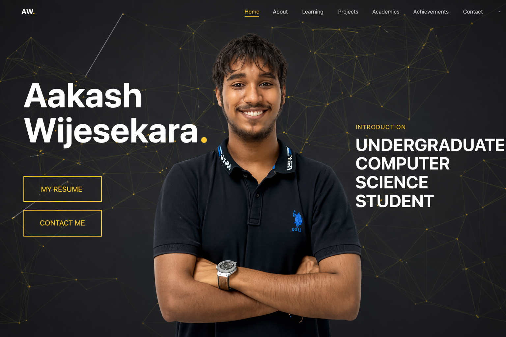
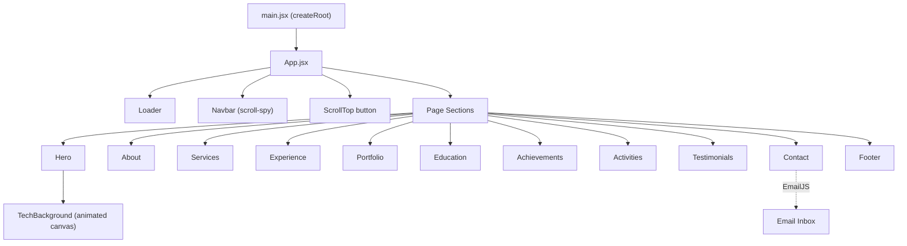
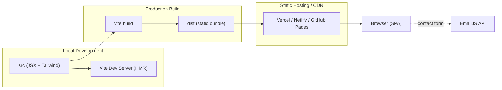
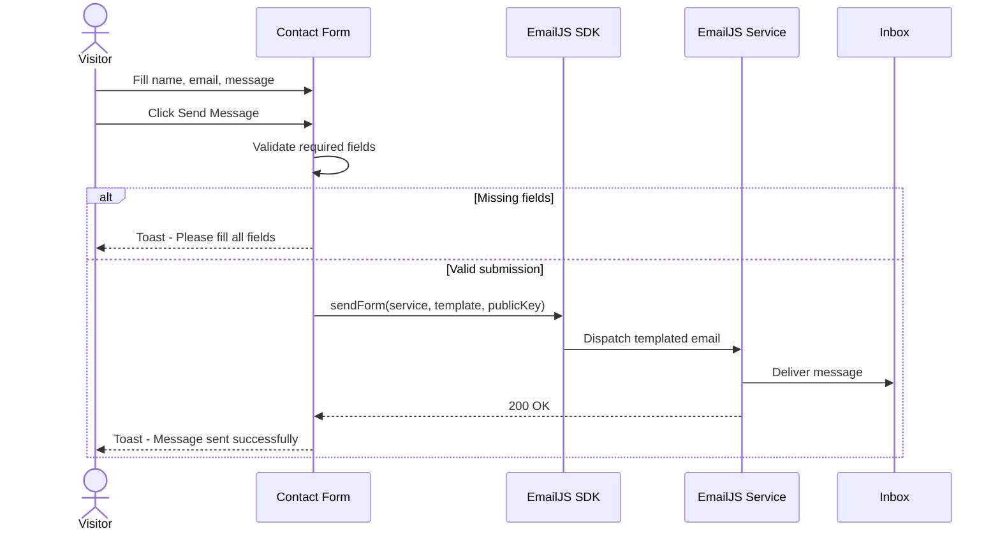

<div align="center">

# Aakash Wijesekara — Portfolio

A fast, animated, single-page personal portfolio built with React and Vite.

Computer Science Undergraduate · Software Engineer Intern at WSO2

<br/>


</div>

---

## Table of Contents

- [Overview](#overview)
- [Features](#features)
- [Technology Stack](#technology-stack)
- [Architecture](#architecture)
  - [Component Tree](#component-tree)
  - [Build and Runtime Flow](#build-and-runtime-flow)
  - [Contact Form Flow](#contact-form-flow)
- [Project Structure](#project-structure)
- [Getting Started](#getting-started)
- [Configuration](#configuration)
- [Available Scripts](#available-scripts)
- [Deployment](#deployment)
- [License](#license)

---

## Overview

A modern, responsive single-page application (SPA) that presents my background, skills,
professional experience, projects, education, achievements, and testimonials, together with
a working contact form powered by [EmailJS](https://www.emailjs.com/).

The site is built as a **static SPA** with no backend server. All content is bundled at build
time and served as static assets, while the contact form communicates directly with the
EmailJS API from the browser.

<div align="center">



</div>

---

## Features

| Feature | Description |
|---|---|
| **Animated UI** | Section reveals, staggered skill bars, and page transitions via Framer Motion. |
| **Fully responsive** | Mobile-first layouts with an accessible slide-down mobile menu. |
| **Smart navigation** | Scroll-spy active-section highlighting and a hide-on-scroll navbar. |
| **Real load gating** | The loader is tied to the actual page `load` event with a safety cap, not a fixed timer. |
| **Performance-aware** | Lazy-loaded below-the-fold images and a prioritized hero image. |
| **Accessibility** | `prefers-reduced-motion` support, ARIA labels, and a keyboard-friendly menu (Esc to close). |
| **Working contact form** | Client-side validation with EmailJS delivery and toast feedback. |
| **SEO ready** | Open Graph and Twitter cards, descriptive meta tags, and a theme color. |

---

## Technology Stack

| Layer | Technologies |
|---|---|
| **Framework** | React 19 |
| **Build Tool** | Vite 7 |
| **Styling** | Tailwind CSS 4 (`@import "tailwindcss"`), PostCSS, Autoprefixer |
| **Animation** | Framer Motion |
| **Icons** | react-icons (Font Awesome, Simple Icons) |
| **Notifications** | react-hot-toast |
| **Email** | emailjs-com |
| **Tooling** | ESLint 9, Vite Preview |

---

## Architecture

### Component Tree



### Build and Runtime Flow



### Contact Form Flow



---

## Project Structure

```text
AAKASH_WIJESEKARA_PORTFOLIO/
├── public/                     Static assets served as-is (favicon, svg)
├── src/
│   ├── assets/                 Images, icons, resume (PDF)
│   ├── components/
│   │   ├── Navbar.jsx          Sticky nav, scroll-spy, mobile menu
│   │   ├── Hero.jsx            Landing section and animated background
│   │   ├── TechBackground.jsx  Canvas particle/network background
│   │   ├── About.jsx           Bio and animated technical skill bars
│   │   ├── Services.jsx        Areas of learning and practice
│   │   ├── Experience.jsx      Professional experience (WSO2)
│   │   ├── Portfolio.jsx       Projects grid and detail modal
│   │   ├── Education.jsx       Academic timeline
│   │   ├── Achievements.jsx    Certificates and achievements
│   │   ├── Activities.jsx      Extracurricular activities
│   │   ├── Testimonials.jsx    References
│   │   ├── Contact.jsx         EmailJS contact form
│   │   ├── Footer.jsx          Footer nav and social links
│   │   ├── Loader.jsx          Intro loader
│   │   └── ScrollTop.jsx       Back-to-top control
│   ├── App.jsx                 Composition and loader gating
│   ├── main.jsx                React entry point
│   └── index.css               Tailwind import and base/global styles
├── index.html                  HTML shell and SEO / social meta
├── vite.config.js
├── tailwind.config.cjs
├── postcss.config.cjs
├── eslint.config.js
├── .env.example                Template for EmailJS credentials
└── package.json
```

---

## Getting Started

### Prerequisites

- **Node.js >= 20.19** (required by Vite 7)
- **npm** (bundled with Node)

### Installation

```bash
# 1. Install dependencies
npm install

# 2. Create your environment file
cp .env.example .env
#    then fill in your EmailJS values (see Configuration below)

# 3. Start the dev server
npm run dev
```

The app runs at **http://localhost:5173** by default.

---

## Configuration

The contact form uses [EmailJS](https://dashboard.emailjs.com/). Provide the following
environment variables in a `.env` file at the project root. Vite only exposes variables
prefixed with `VITE_`.

| Variable | Description |
|---|---|
| `VITE_EMAILJS_SERVICE_ID` | EmailJS service ID |
| `VITE_EMAILJS_TEMPLATE_ID` | EmailJS email template ID |
| `VITE_EMAILJS_PUBLIC_KEY` | EmailJS public key |

> `.env` is git-ignored; `.env.example` is tracked as a template.

---

## Available Scripts

| Command | Description |
|---|---|
| `npm run dev` | Start the Vite dev server with HMR |
| `npm run build` | Produce an optimized production build in `dist/` |
| `npm run preview` | Serve the production build locally |
| `npm run lint` | Run ESLint across the project |

---

## Deployment

Any static host works because the output in `dist/` is fully static.

1. Build the site:
   ```bash
   npm run build
   ```
2. Deploy the `dist/` folder to a static host (for example **Vercel**, **Netlify**, or
   **GitHub Pages**).
3. Set the `VITE_EMAILJS_*` environment variables in your host's dashboard so the contact
   form works in production.

---

## License

**© Aakash Wijesekara. All rights reserved.**

This is a private project. The source code, design, content, and assets are not licensed for
reuse, redistribution, or modification.
